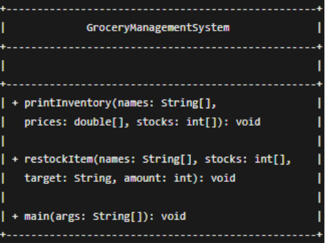
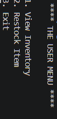
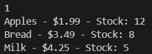
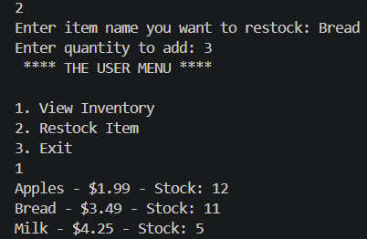
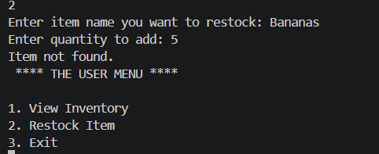

# Grocery Management System

## CS 3354 - Assignment 1

This project is a Java-based Grocery Management System developed as a team assignment for CS 3354. The purpose of the project is to practice Java programming, parallel arrays, methods, loops, user input, documentation, and collaboration using Git and GitHub.

## Project Description

The Grocery Management System stores grocery inventory information using three parallel arrays:

- `String[] itemNames` stores item names.
- `double[] itemPrices` stores item prices.
- `int[] itemStocks` stores the quantity of each item in stock.

The same index in each array represents the same grocery item.

For example, the name, price, and stock stored at index `0` all belong to the same item.

## Program Features

The program provides a menu with the following options:

1. **View Inventory** - Displays all non-empty inventory items along with their prices and current stock quantities.
2. **Restock Item** - Searches for an item by name and adds a specified quantity to its current stock.
3. **Exit** - Ends the program.

If the user attempts to restock an item that does not exist, the program displays:

```text
Item not found.
```

## Methods

### `printInventory()`

```java
public static void printInventory(String[] names,
                                  double[] prices,
                                  int[] stocks)
```

Iterates through the parallel arrays and displays the name, price, and stock quantity for each non-empty inventory slot.

### `restockItem()`

```java
public static void restockItem(String[] names,
                               int[] stocks,
                               String target,
                               int amount)
```

Searches the inventory for the specified item. If the item is found, the requested amount is added to its stock quantity. If the item cannot be found, the program prints `Item not found.`

## How to Compile and Run

### Requirements

- Java Development Kit (JDK)
- Terminal or command prompt

### Compile

From the project directory, run:

```bash
javac GroceryManagementSystem.java
```

### Run

After compilation, run:

```bash
java GroceryManagementSystem
```

The program will display:

```text
**** THE USER MENU ****

1. View Inventory
2. Restock Item
3. Exit
```

Enter the number corresponding to the desired option.

## Javadoc Documentation

Javadoc documentation for the project is stored in the [`docs`](docs/) directory.

The main Javadoc page can be found here:

[`docs/index.html`](docs/index.html)

## UML Class Diagram

The UML class diagram for the Grocery Management System is shown below:



## Program Screenshots

### User Menu



### Inventory Display



### Restocking an Item



### Item Not Found



## Team Contributions

- **Cameron Farris** - Created and organized the GitHub repository, added team members as collaborators, coordinated task assignments and team communication, completed Task 1 (Inventory Display), helped integrate and verify the completed program on the main branch, generated the final Javadoc documentation and added it to the `docs/` folder, created the UML class diagram, created and organized the program execution screenshots, and updated the README with the project description, program features, compilation and execution instructions, documentation, UML diagram, screenshots, and team contributions.
- **Jason Wright** - Worked as part of the team on the assignment and was assigned to Task 2 (Restock & Search).
- **Aagya Bhandari** - Worked as part of the team and was assigned to Task 3 (User Menu).
- **Jose Navarro** - Worked on Task 3 (User Menu) and contributed his implementation to the project.
- **Alibek Makhkamov** - Worked on Task 2 (Restock & Search), created the `integration-docs` branch, and worked on final Javadoc generation and program testing.

## GitHub Collaboration

The project was developed collaboratively using Git and GitHub. Team members worked on individual branches and merged their work into the main branch.

## Project Structure

```text
Assignment-01-Java-program-and-collaboration/
├── GroceryManagementSystem.java
├── README.md
├── docs/
│   └── Generated Javadoc documentation
├── images/
│   └── uml-diagram.png
└── screenshots/
    ├── menu.png
    ├── inventory.png
    ├── restock.png
    └── item-not-found.png
```
